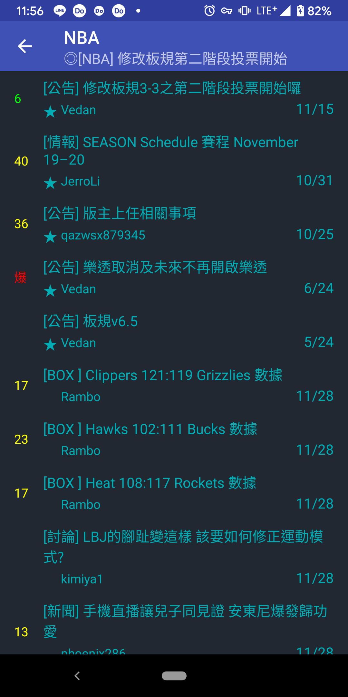
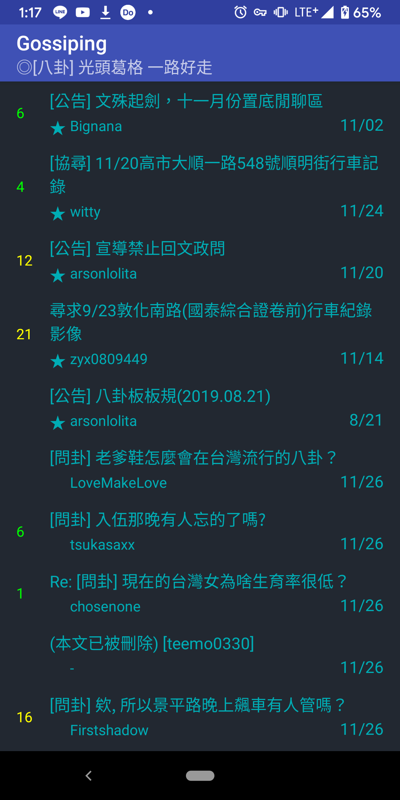
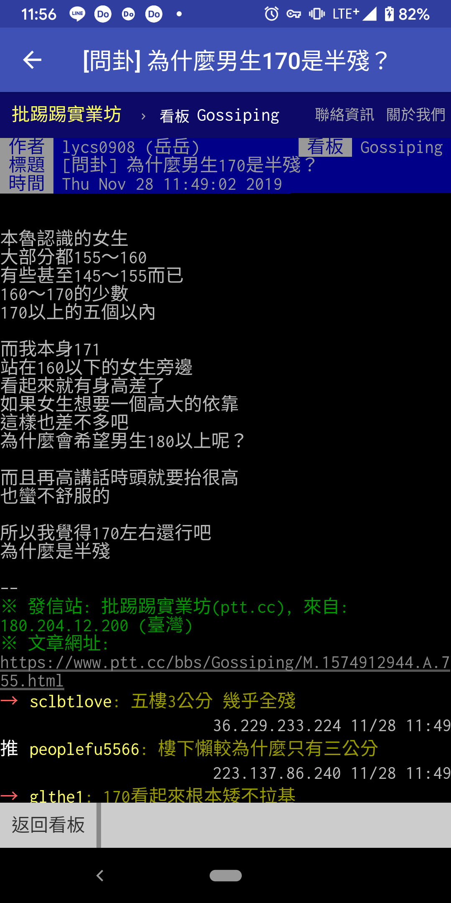

# TYPTT

PTT is a well-known BBS station in Taiwan. I’d like to create a simplify app for PTT.

* Developed the app with Kotlin. 
* Use Android architecture components LiveData, ViewModel and Navigation. 
* Use RxJava and RxAndroid for composing asynchronous. 
* Use jsoup for extracting and manipulating HTML data

## Screenshots

## Functionality

implemented:

* Crawl discussion board order by popularity.
* Designed simple and friendly interface for the home page.
* Enter each board.
* Design article page.

todo:

* Optimize the user interface.
* Filter article by title.

## Author

* Tony Yang - initial & develop basic feature - [tonyyang924](https://github.com/tonyyang924)

## Reference

[PTT BBS website](https://www.ptt.cc/bbs/index.html)

## Feedback

[Create an issue](https://github.com/tonyyang924/TYPTT/issues) for all discussions, bugs, feature requests and pull requests.

## License

This project is licensed under the GPL-3.0 License - see the [LICENSE](LICENSE) file for details.
